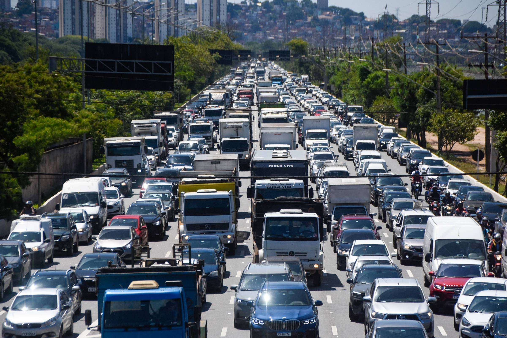
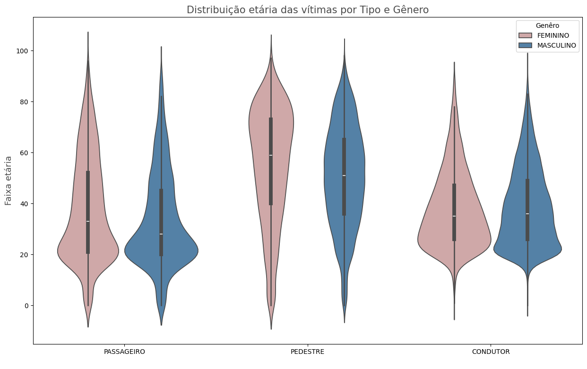

# Acidentes fatais no estado de São Paulo (2015 - 2024)




## INTRODUÇÃO
----
A mobilidade urbana em São Paulo sempre foi um tema amplamente discutido, e uma parte crucial dessa discussão envolve os acidentes fatais. Esta análise exploratória visa abordar esse aspecto trágico da mobilidade urbana.

Gostaria de ressaltar que os números apresentados aqui não são meros dados estatísticos; eles representam vidas, famílias, amigos e histórias que agora permanecem apenas nas memórias de seus entes queridos. Portanto, faço um apelo à conscientização sobre a gravidade dos acidentes de trânsito e expresso meu respeito e luto pelas famílias e amigos afetados por essas tragédias.

O objetivo deste relatório é destacar as falhas na segurança e na fiscalização de trânsito, além de promover a conscientização da população sobre a importância da segurança no trânsito. Trabalhar com dados nos permite obter uma visão abrangente dos acontecimentos passados e presentes, sendo a análise desses dados crucial para exigir políticas públicas eficazes que visem reduzir o número de mortes por acidentes no Estado de São Paulo.

Ao analisar problemas sociais, devemos buscar respostas para quatro perguntas fundamentais para compreender e tentar soluciona-los:

1. Com quem ocorre?
2. Onde ocorre?
3. Quando ocorre?
4. Como ocorre?

Este relatório está estruturado com o objetivo de responder a essas quatro perguntas.

Observação:
    1. Preferi não trabalhar com a média anual, mas sim com o volume total de vítimas em cada cenário abordado nesse relatório.
    2. A base de dados utiliza é pública e pode ser encontrada [aqui](http://www.respeitoavida.sp.gov.br/)

<br><br>
## ANALISANDO OS DADOS
-----
Primeiro, para uma análise mais eficaz, vamos limpar a base de dados.
Aqui removemos os dados onde não tem informações disponíveis.

```python
def carregar_e_limpar_dados(file_path):
    # Carregar os dados
    main_df = pd.read_csv(file_path, encoding='latin1', delimiter=';')

    # Remover dados com status 'NAO DISPONIVEL'
    main_df = main_df[main_df['Sexo'] != 'NAO DISPONIVEL']
    main_df = main_df[main_df['Meio de locomoção da vítima'] != 'NAO DISPONIVEL']
    main_df = main_df[main_df['Tipo de vítima'] != 'NAO DISPONIVEL']
    main_df = main_df[main_df['Tipo de Sinistro'] != 'NAO DISPONIVEL']
    main_df = main_df[main_df['Tipo de via'] != 'NAO DISPONIVEL']
    main_df = main_df[main_df['Turno'] != 'NAO DISPONIVEL']
    
    return main_df
```

<br><br>

# 1. COM QUEM OCORRE
___
Compreender quem são as pessoas afetadas pelo problema social que estamos analisando é o primeiro passo para buscar soluções eficazes. Esse entendimento permite direcionar de forma mais precisa as políticas públicas e as estratégias de conscientização. Ao examinar nosso conjunto de dados, podemos identificar as seguintes informações sobre as vítimas:

+ Genêro
+ Idade
+ Tipo (Motorista, Passageiro, Pedestre,...)
+ Veículo conduzido

## 1.1. Gênero
Vamos analisar qual é o lado mais afetado de acordo com a base de dados.
```python
def analise_por_genero(main_df):

    def func(pct, allvalues):
        absolute = int(pct / 100. * sum(allvalues))
        return f'{absolute} ({pct:.2f}%)'

    cores=sns.color_palette(['#4682b4', '#d6a1a1'])

    genero = main_df['Sexo'].value_counts()
    genero_perc = (genero/genero.sum())*100

    fig, ax = plt.subplots(figsize=(7, 7))
    sns.set_style('ticks')
    ax.pie(genero_perc, labels=genero_perc.index, autopct=lambda pct: func(pct, genero), startangle=140, colors=cores)
    plt.title('Vítimas por gênero', fontsize=21, color=cinza_escuro)
    plt.show()
```


Observa-se que os **homens** são as **principais vítimas** de acidentes de trânsito no Estado de São Paulo, representando **82,5%** do total de mortes.

## 1.2. Idade
Na análise da faixa etária das vítimas, examinamos a distribuição das idades para entender quais grupos etários são mais frequentemente afetados. A seguir, apresentamos a análise da idade das vítimas, incluindo visualizações que mostram a distribuição etária e possíveis padrões.
```python
def distribuicao_etaria(main_df):
    main_df['Idade da vítima'] = main_df['Idade da vítima'].dropna().astype(int)

    idade_homem = main_df[main_df['Sexo'] == 'MASCULINO']['Idade da vítima']
    idade_mulher = main_df[main_df['Sexo'] == 'FEMININO']['Idade da vítima']
    idades_combinadas = pd.concat([idade_homem, idade_mulher])
    idade_mais_obitos_homem = idade_homem.value_counts().idxmax()
    numero_de_obitos_homem = idade_homem.value_counts().max()
    
    idade_mais_obitos_mulher = idade_mulher.value_counts().idxmax()
    numero_de_obitos_mulher = idade_mulher.value_counts().max()
    
    media_idade_homem = idade_homem.mean()
    media_idade_mulher = idade_mulher.mean()

    plt.figure(figsize=(14, 7))
    sns.set_style('whitegrid')

    sns.histplot(idade_homem, color=cores_genero['MASCULINO'], label='Homens', binwidth=1)
    sns.histplot(idade_mulher, color=cores_genero['FEMININO'], label='Mulheres', binwidth=1)

    plt.xlabel('')
    plt.ylabel('N° de vítimas', fontsize=17)
    plt.xticks(fontsize=14)
    plt.yticks(fontsize=15)
    plt.title('Distribuição das idades por gênero', fontsize=20, color=cinza_escuro)
    plt.legend(title='Sexo')
    plt.ylim(0, max(numero_de_obitos_homem, numero_de_obitos_mulher) + 200)
    plt.grid(axis='both', color='lightgrey', linestyle='--')
    
    plt.annotate(
        f'Idade {idade_mais_obitos_homem}\n{numero_de_obitos_homem} Vítimas',
        xy=(idade_mais_obitos_homem, numero_de_obitos_homem),
        xytext=(idade_mais_obitos_homem, numero_de_obitos_homem),
        arrowprops=None,
        fontsize=12,
        color=cinza_escuro
    )
    
    plt.text(
        55, max(numero_de_obitos_homem, numero_de_obitos_mulher), 
        f'Média idade (Homens): {media_idade_homem:.0f} anos',
        fontsize=12, color=cores_genero['MASCULINO']
    )
    plt.text(
        55, max(numero_de_obitos_homem, numero_de_obitos_mulher) - 50, 
        f'Média idade (Mulheres): {media_idade_mulher:.0f} anos',
        fontsize=12, color=cores_genero['FEMININO']
    )

    plt.savefig('.\\media\\obitos_por_idade.png', bbox_inches='tight')
    plt.show()
```


Ao analisar a distribuição das vítimas por faixa etária, começamos a notar padrões significativos. Observamos que a **idade mais afetada é a dos 22 anos**, seguido por uma tendência de diminuição à medida que a idade avança. Isso indica que os jovens, especialmente na faixa dos 20 anos, são mais propensos a sofrer fatalidades em acidentes de trânsito por conta do aumento significativo ao entrar nessa faixa de idade.

Além disso, a **faixa etária dos 30 a 40** anos apresenta uma distribuição relativamente uniforme, sugerindo que, **em média**, as pessoas nessa faixa de idade também **estão sujeitas a riscos consideráveis em acidentes de trânsito**.

## 1.3. Classificação das vítimas
A base analisada clasifca as vítimas em três categorias: Condutor, pedestre e passageiros. Vamos análisar como cada classificação é afetada.

```python
def tipo_vitima(main_df):
    vitimas = main_df['Tipo de vítima'].value_counts()
    vitimas_perc = (vitimas / vitimas.sum()) * 100
    max_value = max(vitimas.values)
    
    fig, ax = plt.subplots(figsize=(10, 7))
    sns.barplot(x=vitimas.index, y=vitimas.values,order=vitimas.index, palette=paleta_tipo_vitima, ax=ax)
    plt.title('Classificação das Vítimas por Tipo', fontsize=20, color=cinza_escuro, pad=20)
    format_plot(ax, max_value)
    add_labels(ax, vitimas.values, max_value, vitimas_perc)
    plt.savefig('.\\media\\vitimas_tipo.png', bbox_inches='tight')
    plt.show()
```


Como podemos observar, os **Condutores** são a maior parte da pessoas que vem a obito em acidente de trânsito constituindo **60.8%** do total de vítimas.
Podemos Separar essa categoria em Genêro:

```python
def tipo_vitima_por_genero(main_df):

    vitimas = main_df['Tipo de vítima'].value_counts()
    vitimas_perc = (vitimas / vitimas.sum()) * 100
    max_value = max(vitimas.values)

    fig, ax = plt.subplots(figsize=(10, 7))
    sns.countplot(data=main_df, x='Tipo de vítima', hue='Sexo', palette=cores_genero, ax=ax, order=vitimas.index)
    format_plot(ax, max_value)
    add_labels(ax, vitimas.values, max_value, vitimas_perc)
    plt.savefig('.\\media\\vitimas_tipo_genero.png', bbox_inches='tight')
    plt.show()
```


Neste cenário, observamos que as **mulheres**, enquanto **passageiras**, sofrem uma **taxa maior de mortalidade em acidentes de trânsito** em comparação com os homens. Por outro lado, os **homens**, na maioria das vezes como **condutores**, apresentam uma **maior incidência de fatalidades**, destacando-se como o grupo mais afetado em termos de mortes no trânsito.
Outra forma de avaliarmos este cenário, é a partir da idade. Qual faixa etária tem maior taxa de óbito em decorrencia da classificação adotada?

```python
def distribuicao_idade_tipo_vitima(main_df):
    fig, ax = plt.subplots(figsize=(15, 9))
    sns.violinplot(x='Tipo de vítima', y='Idade da vítima', hue='Sexo', palette=cores_genero, data=main_df)
    plt.xlim(-0.5, 2.5)
    plt.title('Distribuição etária das vítimas por Tipo e Gênero', fontsize=15, color=cinza_escuro)
    plt.xlabel(' ')
    plt.ylabel('Faixa etária', fontsize=13, color=cinza_escuro)
    plt.savefig('.\\media\\distribuicao_idade_vitima.png', bbox_inches='tight')
    plt.legend(title='Genêro')
    plt.show()
```


O gráfico acima revela que os pedestres enfrentam um **risco crescente** de acidentes **à medida que envelhecem**. Além disso, **mulheres mais velhas** são particularmente vulneráveis a esse tipo de fatalidade, destacando-se como o **grupo mais afetado**.

## 1.4. Veículo da vítima
Para entender mais o perfil de quem é mais afetado, vamos classificar os veículos das vítimas.

```python
def meio_transporte_vitima(main_df):
    veiculos = main_df['Meio de locomoção da vítima'].value_counts()
    veiculos_perc = (veiculos / veiculos.sum()) * 100
    max_value = max(veiculos.values)

    sns.set_style('whitegrid')
    fig, ax = plt.subplots(figsize=(10, 7))
    sns.countplot(data=main_df, x='Meio de locomoção da vítima', order=veiculos.index, palette=paleta_tipo_veiculo)
    format_plot(ax, max_value)
    plt.xlabel(' ')
    add_labels(ax, veiculos.values, max_value, veiculos_perc)
    plt.title('Veículos das vítimas', fontsize=20, color=cinza_escuro, pad=20)
    plt.savefig('.\\media\\vitimas_por_veiculos.png', bbox_inches='tight')
    plt.show()
```


Então até aqui sabemos que homens condutores são a maior parte da vítimas, mas o grafico mostra também que os ciclistas são a maior parte das vitimas constituindo **37.4%** do total. Então, com base nos dados anteriores podemos constatar que os homens motociclistas constituem a maior parte dos óbitos. 
Vamos apresentar melhor essa distribuição utilizando a faixa etária como parametro. 


```python
def meio_transporte_genero(main_df):
    veiculos = main_df['Meio de locomoção da vítima'].value_counts()
    veiculos_perc = (veiculos / veiculos.sum()) * 100
    max_value = max(veiculos.values)
    
    fig, ax = plt.subplots(figsize=(10, 7))
    sns.boxplot(x='Meio de locomoção da vítima',
                y='Idade da vítima', hue='Sexo',
                palette=cores_genero, order=veiculos.index,
                data=main_df
            )
    plt.title('Faixa etária das vítimas por veículo', fontsize=21)
    plt.xlabel(' ')
    plt.ylabel('Faixa etária', fontsize=13, color=cinza_escuro)
    plt.legend(title='Genêro')
    plt.savefig('.\\media\\idade_vitimas_veiculo.png', bbox_inches='tight')
    plt.show()
```


A vizualização acima apenas reforça dois pontos já apresentados.
1. A média etária de óbitos esta na faixa etária dos 40 anos. 
2. As mulheres, na condição de pedestres, apresentam um aumento significativo no volume de vítimas de atropelamento à medida que envelhecem.

<br><br>

# 2. ONDE ACONTECE
_______
Identificar onde ocorrem os acidentes é crucial para desenvolver estratégias eficazes para prevenir esses eventos. Focar nos locais com maior concentração de acidentes é uma maneira eficaz de abordar e reduzir significativamente o problema.

## 2.1. Mapa de São Paulo
Vamos analisar a distribuição de ocorrências atraves do mapra do Estado de São Paulo.
Aqui utilizamos métodos para calculo de coordenadas para delimitar o máximo possível o território em questão:

```python
def distribuicao_geografica(main_df):

    main_df_filtered = main_df_filtered[
        (main_df_filtered['latitude'] >= -25.4383) & (main_df_filtered['latitude'] <= -19.7518) &
        (main_df_filtered['longitude'] >= -53.0288) & (main_df_filtered['longitude'] <= -44.0723)
    ]

    gdf = gpd.GeoDataFrame(main_df_filtered, geometry=gpd.points_from_xy(main_df_filtered.longitude, main_df_filtered.latitude))

    gdf.crs = {'init': 'epsg:4326'}
    gdf = gdf.to_crs(epsg=3857)

    fig, ax = plt.subplots(figsize=(20, 12))
    gdf.plot(ax=ax, markersize=1, color='black', alpha=0.5)
    ctx.add_basemap(ax, source=ctx.providers.OpenStreetMap.Mapnik)
    plt.title('Concentração de acidentes fatais no Estado de São Paulo (2015 - 2024)', fontsize=15, color=cinza_escuro)
    ax.set_axis_off()
    plt.savefig('.\\media\\densidade_geografica.png', bbox_inches='tight')
    plt.show()
```


Com base na distribuição apresentada, observamos que a região da **Grande São Paulo** é a **mais afetada**. À medida que nos deslocamos para o interior, a densidade de acidentes se torna mais uniforme em comparação com as áreas centrais e litorâneas.

## 2.2. Vias
Agora que sabemos que a maioria dos acidentes fatais ocorre na capital, é importante identificar quais tipos de vias contribuem para esses números.

```python
def vias(main_df):
    vias = main_df['Tipo de via'].value_counts()
    vias_perc = (vias / vias.sum()) * 100
    max_value = max(vias.values)

    sns.set_style('whitegrid')
    fig, ax = plt.subplots(figsize=(10, 7))
    sns.countplot(data=main_df, x='Tipo de via', palette=paleta_tipo_veiculo, order=vias.index)
    plt.title('Tipos de via', fontsize=15, color=cinza_escuro)
    
    format_plot(ax, max_value)
    add_labels(ax, vias.values, max_value, vias_perc)
    plt.savefig('.\\media\\tipos_vias.png', bbox_inches='tight')
    plt.show()
```


O resultado acima indica que os acidentes ocorrem com maior frequência em vias municipais, que são áreas urbanas com grande concentração de pedestres e motoristas. Isso pode ser atribuído à gestão inadequada dessas vias, à sinalização deficiente e à falta de educação no trânsito para os condutores.

Podemos também nos perguntar os tipos de vitimas distribuidos entre as vias.

```python
def via_por_vitima(main_df):
    sns.set_style('whitegrid')
    fig, ax = plt.subplots(figsize=(10, 7))
    sns.countplot(data=main_df, x='Tipo de via', hue='Tipo de vítima', palette=paleta_tipo_veiculo)
    plt.title('Número de vítimas em Vias Municipais X Rodovias (tipo de vítima)', fontsize=15, color=cinza_escuro, pad=20)
    plt.ylabel('Número de vítimas', fontsize=15)
    plt.xlabel(' ')
    plt.xticks(fontsize=13, color=cinza_escuro)
    plt.legend(title='Tipo de vítima', loc='upper right')
    plt.savefig('.\\media\\tipos_vias_vitimas.png', bbox_inches='tight')
    plt.show()
```


Em ambos os casos, observamos um padrão claro: os condutores são os mais afetados, seguidos pelos pedestres, e, por último, pelos passageiros. Mas, em vias municipais, esses numeros são mais acentuados e a distância entre eles também.

E por último veremos os tipo de veículo das vitimas nessas vias.

```python
def via_por_vitima(main_df):
    def analyze_road_type_by_vehicle(main_df):
    sns.set_style('whitegrid')
    fig, ax = plt.subplots(figsize=(10, 7))
    sns.countplot(data=main_df, x='Tipo de via', hue='Meio de locomoção da vítima', palette=paleta_tipo_veiculo)
    plt.title('Número de vítimas em Vias Municipais X Rodovias (Tipo de Veículo)', fontsize=15, color=cinza_escuro)
    plt.ylabel('Número de vítimas', fontsize=13, color=cinza_escuro)
    plt.xlabel(' ')
    plt.xticks(fontsize=13)
    plt.legend(title='Veículo da vítima', loc='upper right')
    plt.savefig('.\\media\\via_por_veiculo.png', bbox_inches='tight')
    plt.show()
```


Aqui podemos analisar dois expoentes: As motocicletas em vias municipais e os carros em rodovias, mas mesmo neste segundo cenário, a difença entre carro e motocicleta é pequena.

<br><br>

# 3. QUANDO ACONTECE
_____
Traçar uma linha do tempo dos acontecimentos é de extrema importância para entendermos a evolução do problema ou da solução.
Por isso, abaixo vamos realizar algumas divisões temporais para nos aprfundarmos mais neste assunto.

## 3.1. Mês do ano

```python
def analise_mensal(main_df):

    mes = main_df['Mês do Óbito'].value_counts()
    mes_perc = (mes / mes.sum()) * 100
    max_value = max(mes.values)

    mes_obito = main_df['Mês do Óbito'].value_counts().sort_index()
    df_area = pd.DataFrame({'Mês do Óbito': mes_obito.index, 'Número de Vítimas': mes_obito.values})

    fig, ax = plt.subplots(figsize=(10, 7))
    sns.set_style('whitegrid')
    plt.xticks(df_area['Mês do Óbito'], ha='right')
    sns.lineplot(x='Mês do Óbito', y='Número de Vítimas', data=df_area, color=cinza_escuro, marker='o', linewidth=2.4, linestyle='-')
    plt.title('Frequência de acidentes fatais distribuidos por mês', fontsize=15, color=cinza_escuro)
    plt.ylabel('Número de vítimas', fontsize=13, color=cinza_escuro)
    plt.xlabel('')
    plt.xticks(fontsize=13)
    plt.savefig('.\\media\\vitimas_por_mes.png', bbox_inches='tight')
    plt.show()
```


Podemos observar que, em períodos comemorativos, há uma tendência de aumento nas fatalidades, como, por exemplo, no Carnaval.

## 3.2 Dia da Semana
```python
def analise_dia_semana(main_df):
    dia_semana_obito = main_df['Dia da Semana'].value_counts().sort_index()
    dia_semana_obito_perc = (dia_semana_obito / dia_semana_obito.sum()) * 100
    max_value = max(dia_semana_obito.values)

    fig, ax = plt.subplots(figsize=(10, 7))
    sns.set_style('whitegrid')
    sns.countplot(data=main_df, x='Dia da Semana', palette=paleta_tons_escuros, order=dia_semana_obito.index)
    format_plot(ax, max_value)
    add_labels(ax, dia_semana_obito.values, max_value, dia_semana_obito_perc.values)
    plt.title('Acidentes fatais de acordo com os dias da semana', fontsize=15, color=cinza_escuro)
    plt.savefig('.\\media\\vitimas_dia_semana.png', bbox_inches='tight')
    plt.show()
```


Como era de se esperar, os **finais de semana** são os **mais afetados** por esse tipo de ocorrência. Durante esses dias, muitos jovens, que representam a maioria das vítimas, saem para festas e outros eventos sociais, aumentando a exposição ao risco e, consequentemente, a ocorrência de acidentes.

## 3.3. Turnos
```python
def analise_turnos_dia(main_df):
    turno_obito = main_df['Turno'].value_counts().sort_index()
    turno_obito_perc = (turno_obito / turno_obito.sum()) * 100
    max_value = max(turno_obito.values)

    fig, ax = plt.subplots(figsize=(10, 7))
    sns.set_style('whitegrid')  
    sns.countplot(data=main_df, x='Turno', palette=paleta_tons_escuros, order=turno_obito.index)
    format_plot(ax, max_value)
    add_labels(ax, turno_obito.values, max_value, turno_obito_perc.values)
    plt.title('Mortes fatais de acordo com os turnos do dia', fontsize=15, color=cinza_escuro)
    plt.savefig('.\\media\\vitimas_por_turno.png', bbox_inches='tight')
    plt.show()
```


Em resumo, as mortes em acidentes de trânsito ocorrem com **maior frequência** em **datas comemorativas**, nos **finais de semana** e durante a **noite**. Esses períodos apresentam um aumento significativo nas atividades sociais, o que contribui para o aumento de acidentes fatais.

<br><br>

# 4. COMO ACONTECE
______
Por último, analizaremos como que esses acidentes evoluem, seja por uma colisão entre veiculos, atropelamento, entre outros.

## 4.1. Tipos de acidentes
A classificação é extensa, por isso irei analisar os 5 tipos mais ocorrentes.
```python
def tipos_acidentes(main_df):
    
    tipo_sinistro = main_df['Tipo de Sinistro'].value_counts()
    tipo_sinistro_perc = (tipo_sinistro / tipo_sinistro.sum()) * 100
    
    top_tipo_sinistro = tipo_sinistro.nlargest(5).index
    top_5_df = main_df[main_df['Tipo de Sinistro'].isin(top_tipo_sinistro)]

    ttipo_sinistro = top_5_df['Tipo de Sinistro'].value_counts()
    ttipo_sinistro_perc = (ttipo_sinistro / ttipo_sinistro.sum()) * 100
    max_value = max(ttipo_sinistro)

    fig, ax = plt.subplots(figsize=(10, 7))
    sns.set_style('whitegrid')
    sns.countplot(data=top_5_df, x='Tipo de Sinistro', order=ttipo_sinistro.index, palette=paleta_tons_escuros)
    add_labels(ax, ttipo_sinistro.values, max_value, ttipo_sinistro_perc.values)
    format_plot(ax, max_value)
    plt.title('Tipos de acidentes fatais (Top 5)', fontsize=15, color=cinza_escuro)
    plt.savefig('.\\media\\tipos_acidentes.png', bbox_inches='tight')
    plt.show()
```


O resultado apresentado mostra com clareza a fatalidade do **atropelamento** com **quase o dobro** de óbitos em **relação ao segundo lugar**.

## 4.2 Veículos envolvidos
Agora veremos se houve algum outro veiculo envolvido que levou a vitima a óbito.
```python
def veiculos_evolvidos(main_df):
    outro_veiculo_envolvido = main_df['Outro Veículo Envolvido'].value_counts()
    outro_veiculo_envolvido_perc = (outro_veiculo_envolvido / outro_veiculo_envolvido.sum()) * 100
    max_value = max(outro_veiculo_envolvido)

    fig, ax = plt.subplots(figsize=(10, 7))
    sns.set_style('whitegrid')
    sns.countplot(data=main_df, x='Outro Veículo Envolvido',
                   order=outro_veiculo_envolvido.index, palette=paleta_tons_escuros)
    format_plot(ax, max_value)
    add_labels(ax, outro_veiculo_envolvido.values, max_value, outro_veiculo_envolvido_perc.values)
    plt.title('Envolvimento de outros veículos nos acidentes', fontsize=15, color=cinza_escuro)
    plt.savefig('.\\media\\veiculos_envolvidos.png', bbox_inches='tight')
    plt.show()
```


Nessa etapa, concluímos dois pontos principais:

1. As colisões são a maior causa de fatalidades no trânsito, seguidas pelos atropelamentos.

2. Automóveis são responsáveis pelo maior número de fatalidades.

Esses pontos se explicam mutuamente: como os automóveis são os mais responsáveis pelos acidentes e os motoristas são as principais vítimas, as colisões acabam resultando em um maior número de fatalidades.

# CONCLUSÕES
____

## Conclusão dos dados
Alguns dados relevantes:
+ Homens representam **82.5%** da vítimas.
+ Motociclistas representam **34.4%** da vítimas.
+ Condutores e passageiros costumas ser mais jovens, já os pedestres costumas ser mais velhos.
+ Pedestres mulheres são a maior parte das vitimas de atropelamentos à medida que envelhcem.
+ As vias municipais tiveram mais óbitos que as rodovias.
+ Municipios com mais mortes estão concentrados na capital.
+ As tragédias aumentam consideravelemnte em datas comemorativas, finais de semana (**~40%**) e no período noturno (**37.1%**).
+ As colisões seguido do atropelamento se destacam nos tipos de acidentes fatais.

## Conclusão Final
